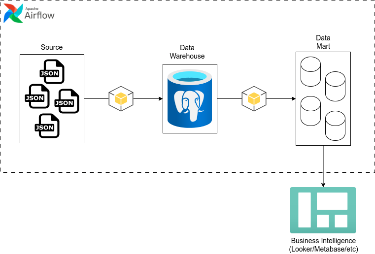
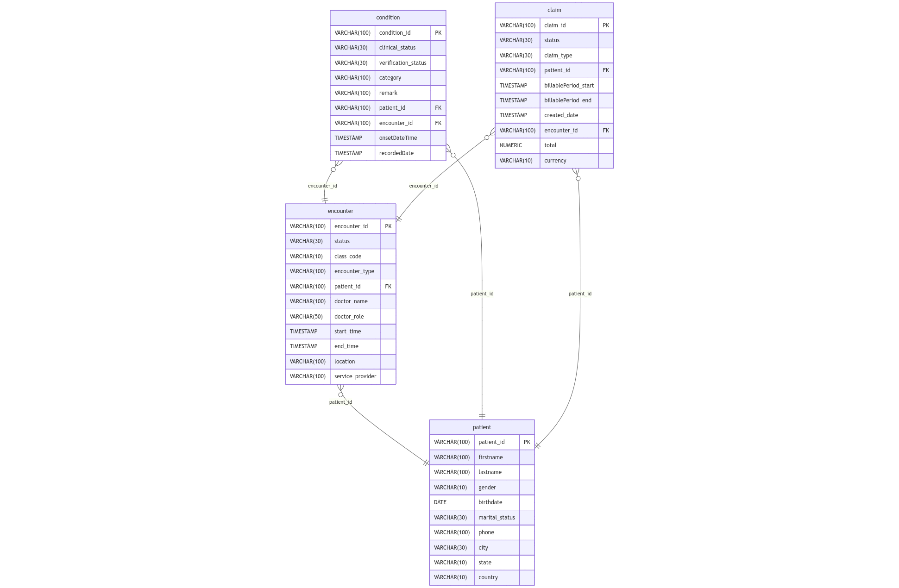
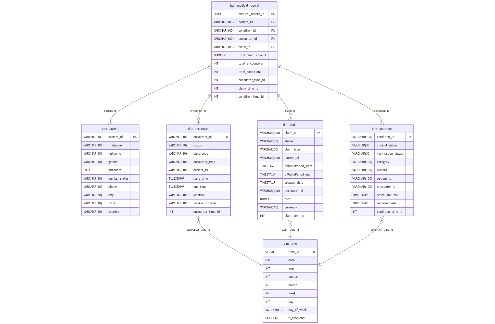

# 🏥 Healthcare Data Analytics Project

This project is a healthcare analytics solution designed to extract insights from synthetic FHIR-based medical data. It provides structured pipelines and visualizations to support real-world use cases such as patient claim analysis, healthcare provider efficiency, chronic condition tracking, and patient segmentation. Data is sourced from the open-source Synthea project and processed using modern data engineering tools.

---

## 📦 Data Source

We are using the synthetic dataset provided by Synthea:  
🔗 [Download Latest FHIR Sample Data](https://synthetichealth.github.io/synthea-sample-data/downloads/latest/synthea_sample_data_fhir_latest.zip)

---

## 🎯 Business Use Cases

### ✅ Use Case 1: Monthly Patient Claim Analysis
**Question**: What is the total medical claim expenditure by patients each month, and what are the spending trends throughout the year?  
**(Bahasa)**: Berapa total klaim medis yang dikeluarkan oleh pasien setiap bulan, dan bagaimana tren pengeluarannya sepanjang tahun?

---

### ✅ Use Case 2: Service Performance by Location and Provider
**Question**: Which locations and service providers handle the most patient encounters, and how efficient are they?  
**(Bahasa)**: Lokasi dan service provider mana yang paling banyak menangani encounter pasien dan seberapa efisien mereka?

---

### ✅ Use Case 3: Most Common Chronic Conditions and Their Distribution
**Question**: What are the most frequently recorded medical conditions, and which patients experience them repeatedly?  
**(Bahasa)**: Apa saja kondisi medis yang paling sering tercatat, dan siapa saja pasien yang mengalaminya secara berulang?

---

### ✅ Use Case 4: Patient Segmentation by Demographics and Medical History
**Question**: How can we group patients based on age, marital status, and number of encounters or chronic conditions?  
**(Bahasa)**: Bagaimana kita bisa mengelompokkan pasien berdasarkan usia, status pernikahan, dan jumlah encounter atau kondisi yang mereka alami?

---

## 🛠 Tools & Technologies

- **Python** – for data processing and transformation  
- **PostgreSQL** – relational database and data warehouse  
- **Apache Airflow** – for ETL orchestration  
- **Mermaid.js** – to visualize ERD and DWH structure  

---

## 📊 Data Pipeline



---

## 🧱 ERD and Data Warehouse Design

### Entity Relationship Diagram (ERD)


### Data Warehouse Structure (DWH)


---

## 🚀 How to Run the Project

1. **Clone the repository**

```bash
git clone https://github.com/gugusx/healthcare-BI.git
cd healthcare-BI/
```

2. **Prepare your PostgreSQL database and run the schema DDL:**
```bash
psql -U <user> -d <database_name> -f schema_DDL.sql
```

3. **Run with Docker**
```bash
docker compose build && docker compose up --build
```
